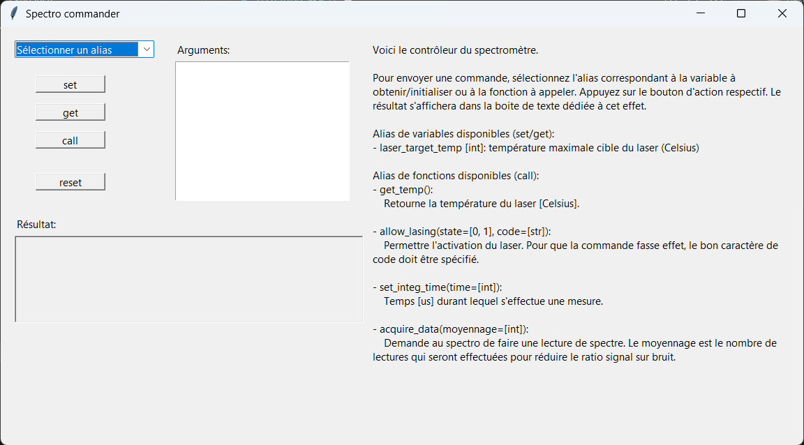
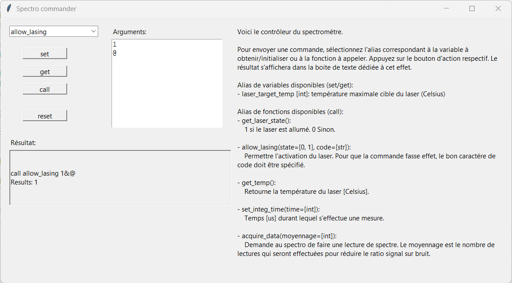
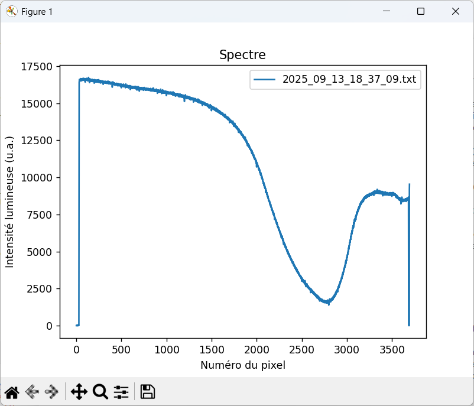
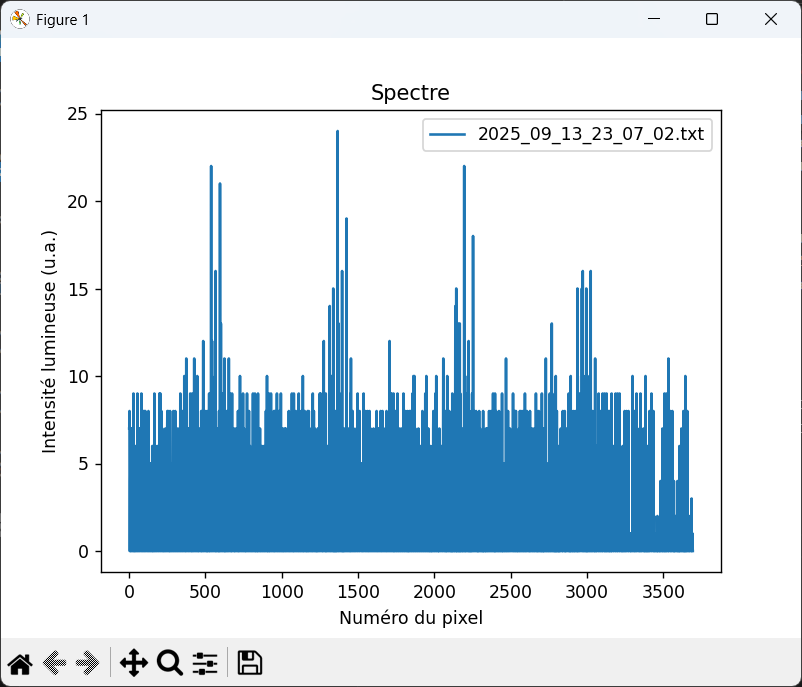
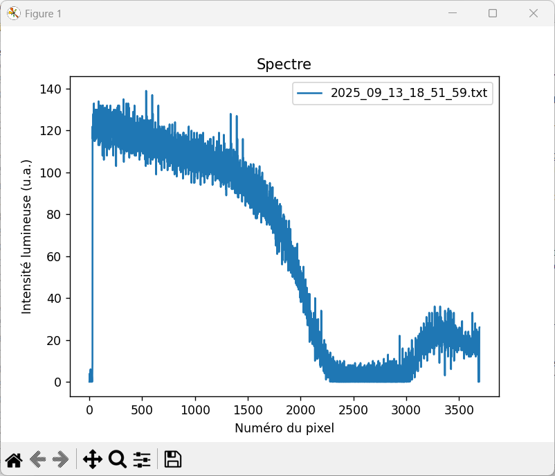
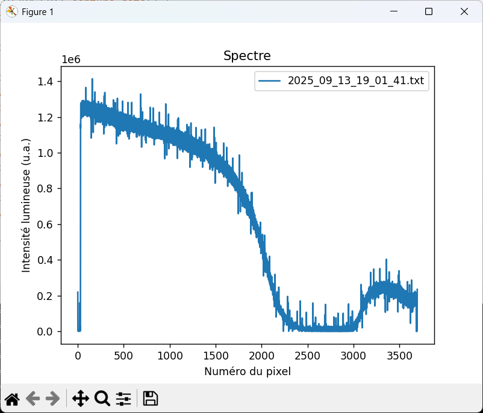
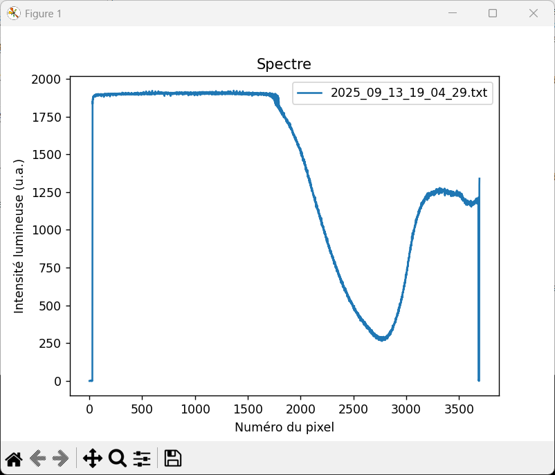
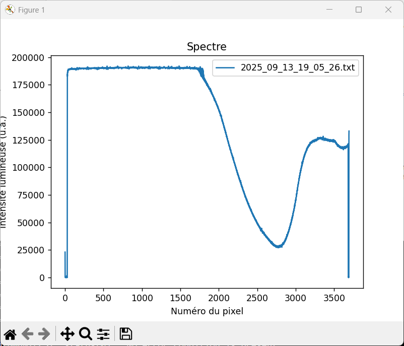
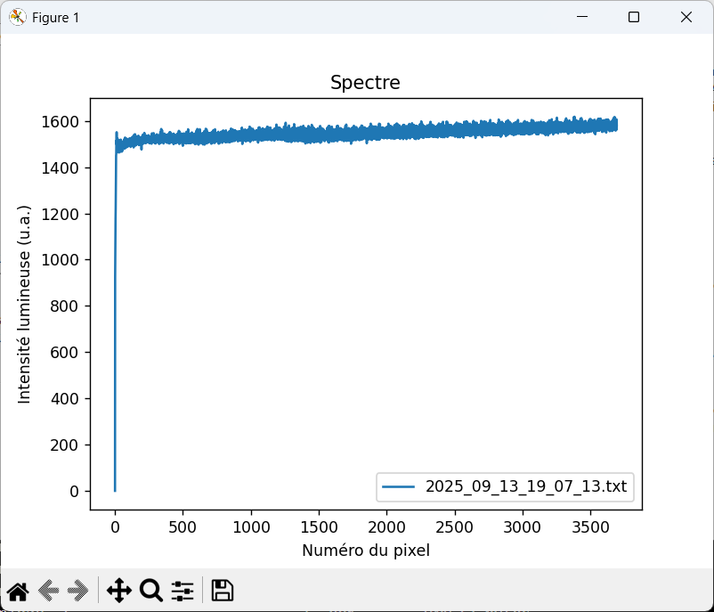

# Tutoriel sur l'utilisation du spectromètre


## Contrôle du spectromètre à partir de chaines de caractère
Le spectromètre peut se contrôler avec des chaines de caractères envoyées sur le port série.
La structure d'une commande est `<verbe> <sujet> [complément]` où le verbe et le sujet sont obligatoires et le complément est optionnel (dépend du verbe et du sujet).
Les sujets peuvent être soit une variable, soit une fonction.
Lorsque plusieurs compléments sont spécifiés, ils doivent être séparés par le caractère `&`.

Les verbes disponibles pour une variable sont `"set"` et `"get`" et permettent d'initialiser ou de lire sa valeur.
Voici un exemple:
```
set laser_target_temp 25

get laser_target_temp
# Résultat: 25
```

Le verbe disponible pour une fonction est `"call"`.
En voici quelques exemples:
```
call get_temp
# Résultat: 21.37

call allow_lasing 1&@
# Résultat:

call acquire_data 3
# Résultat: 0,924,1024, ...
```


## Interface graphique
Le spectro peut aussi se contrôler avec une interface graphique (voir la figure ci-bas).
Il faut d'abord choisir le nom d'alias pour une variable ou une fonction à partir de la liste déroulante.
Les arguments doivent également être entrées dans la zone réservée à cet effet.
Si plusieurs arguments sont requis, ils doivent être séparés par un retour à la ligne.
Dépendamment du sujet, les verbes `set`/`get` ou `call` peuvent être choisis en appuyant sur les bouttons ce qui envoie la commande au spectro.
La commande envoyée ainsi que le résultat s'afficheront dans la boite en bas.
La zone à droite de l'interface présente une brève description des variables et fonctions disponibles pour le spectro.




## Initialisation des paramètres de mesure
Avant d'effectuer une première mesure avec le spectromètre, il faut initialise les paramètres de mesure.
Les paramètres disponibles sont `allow_lasing` et `set_integration_time`.


### 1) `allow_lasing`
Par défaut, le laser ne peut pas s'allumer par mesure de sécurité ce qui empêche de prendre un spectre.
La fonction `allow_lasing` permet de débarrer cette fonction.
Le premier paramètre est un booléen qui permet ou non l'activation du laser.
Le second est un caractère de sécurité qui doit être entré, sans quoi la commande empêche l'activation du laser.
Ce caractère est `@`.
La figure ci-dessous présente un exemple d'appel de cette fonction.




### 2) `set_integration_time`
Un capteur CCD présent dans le spectro permet la lecture des spectres.
Ce dernier fonctionne grossièrement en laissant entrer des photons pendant un temps d'intégration `time` [$\mu s$].
Plus le temps d'intégration est long, plus le capteur sera sensible et moins le ratio signal sur bruit sera grand ce qui est souhaitable.
Cependant, passé une certaine valeur, le CCD devient saturé ce qui empêche toute lecture de spectre.
Il est donc important de trouver une valeur inférieure à ce seuil (qui dépend de la luminosité ambiante, la transparence de l'échantillon, la puissance du laser, ...).
La section [Ajustement du temps d'intégration](#ajustement-du-temps-dintégration) fournit un guide pour aider à déterminer ce temps optimal.


## Acquisition des données
L'acquisition des données se fait avec la fonction `acquire_data`.
L'argument est le nombre de mesures prises pour moyenner le bruit.
Par exemple, la commande `call acquire_data 10` prendra 10 spectres avec le temps d'intégration spécifié plus tôt, puis sommera les valeurs obtenues pour chaque pixel.
Les résultats sont retournés sous la forme d'une chaine de caractère où les valeurs des pixels sont séparées par des virgules.
Une courbe de calibration est également mesurée, puis soustraite du spectre avant de retourner les données afin de supprimer le bruit de fond.

Les résultats sont automatiquement affichés à l'aide de matplotlib et enregistrés dans le répertoire `Spectres_data\`.
Le nom du fichier est indiqué dans le graphique matplotlib tel que présenté ci-bas.
Plusieurs appels de `acquire_data` sans fermer le graphique superposent les spectres.




## Contrôle de la température du laser
La température du laser du spectro est automatiquement régulée 10 fois par seconde par le Arduino.
Cette régulation implique d'allumer le système de refroidissement du laser lorsque sa température est trop élevée et d'allumer le ventilateur pour permettre l'évacuation de la chaleur.
Ce dernier s'éteint automatiquement 5 minutes après que la température du laser soit retombée sous la cible fixée.
La variable `laser_target_temp` [$^oC$] permet à l'utilisateur de spécifier cette cible.
La valeur par défaut est de $25^oC$.


## Ajustement du temps d'intégration
Cette section se veut un guide pour aider l'utilisateur à déterminer un temps d'intégration optimal pour la lecture par le capteur CCD du spectro.


### Temps d'intégration trop faible
Si le temps d'intégration est trop faible, un graphique comme le suivant peut être obtenu.
On observe du bruit autour de zéro.



Si le temps d'intégation est plus long, on obtient une courbe qui ressemble plus à celle qui suit.
Le spectre commence à apparaitre, mais beaucoup de bruit est présent.



Ce bruit peut être réduit en augmentant le nombre de mesures.
Dans ce cas, `n_mesures` est passé de 1 à 10000.




### Temps d'intégration adéquat
Or, augmenter le nombre de mesures n'est pas la meilleure option, car le bruit est toujours présent et les mesures peuvent devenir très longues.
L'option à privilégier est d'augmenter le temps d'intégration.
La figure suivant montre un temps d'intégration optimal.
On voit que le ratio signal sur bruit est bien moindre.



Augmenter le nombre de mesures permet de réduire encore plus ce ratio (figure suivante).




### Temps d'intégration trop grand
En revanche, si le temps d'intégration est trop élevé, le capteur CCD sera saturé et le spectre ne sera plus visible.
La figures suivante présente un exemple de spectre saturé.



